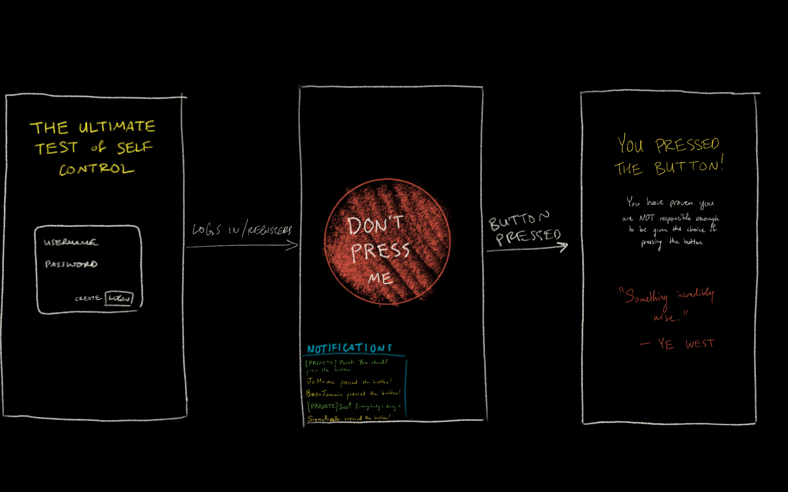
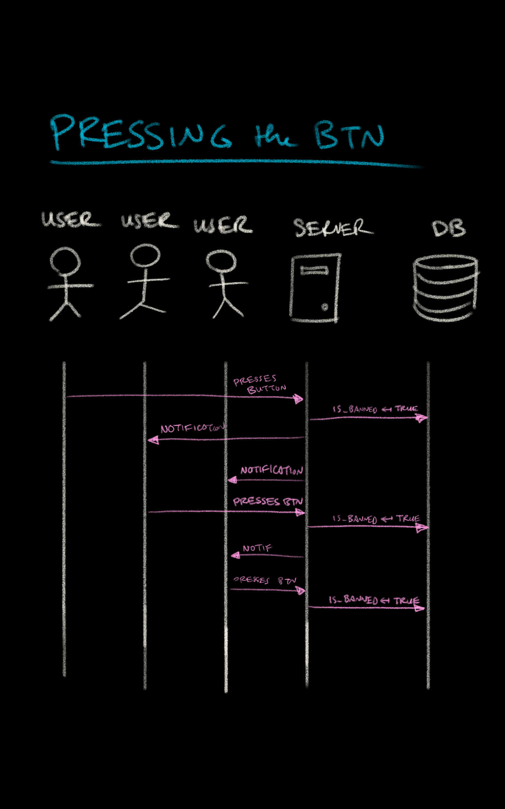

# Please don't touch

One button. One instruction. But temptation is strong...

It was Gandhi who once said that "the simplest tests reveal the most about one's true character."1 This single button test, being the simplest a test can be, thus reveals the truest aspects of one's character.

## 🚀 Specification Deliverable

For this deliverable I did the following. I checked the box `[x]` and added a description for things I completed.

- [X] Proper use of Markdown
- [X] A concise and compelling elevator pitch
- [X] Description of key features
- [X] Description of how you will use each technology
- [X] One or more rough sketches of your application. Images must be embedded in this file using Markdown image references.

(TODO: Delete this checklist after this assignment is graded.)

### Elevator pitch

The paradox with freewill is that it is not free&mdash;it comes with responsibility. Those who exercise their freewill with ill intent don't deserve to have it. *Please Don't Touch* presents users with a single button along with explicit instructions: "Don't press me." A user proves they can uphold the responsibility of such a choice by choosing not to do it. Users who press the button demonstrate they are not deserving of that responsibility, and they are thus banned from the site. 

### Design

This sequence diagram illustrates interactions between users, the server, and the database when a user presses the button:

### Key features

- A button that can be pressed. (But shouldn't!)

### Technologies

I am going to use the required technologies in the following ways.

- **HTML** - Basic structure and site scaffolding.
- **CSS** - Making the website look pretty and professional.
- **React** - Interactivity with the button.
- **Service**:
    - Support for login, logout, and registering users.
    - Server endpoints: 
        - How long they have been resisting the button's temptation (i.e. how long since they first logged in), 
        - whether or not a user has pressed the button,
        - when the user pressed the button (if they have), and
        - how long the user lasted before pressing the button (if they've pressed it).
    - Calls to [kanye.rest](https://kanye.rest/)'s API to provide banned users with inspirational quotes from Kanye West&mdash;who philosophers unaminously agree is the wisest man on Earth2.
- **DB/Login** - Save login info, and track whether a user has pressed the button (and is thus banned from the site) or not.
- **WebSocket** - Updating users when other people have pressed the button. (Mob mentality adds extra temptation...)

### Sources

1. Gandhi never said that&mdash;nor did anyone else that I know of. Did I fool you?
2. Philosophers do not believe this.

## 🚀 AWS deliverable

For this deliverable I did the following. I checked the box `[x]` and added a description for things I completed.

- [X] **Server deployed and accessible with custom domain name** - [My server link](https://youmustnot.click).

## 🚀 HTML deliverable

For this deliverable I did the following. I checked the box `[x]` and added a description for things I completed.

- [X] **HTML pages**: I have four pages: `index.html` just redirects to `login.html`; `login.html` is the landing page, where the user logins/registers; `button.html` houses the button (which the user MUST not press); and `banned.html` is where maldoers who press the button are sent.
- [X] **Proper HTML element usage**: I learned about many different HTML elements and implemented them wisely and correctly. These include header, footer, main, body, style, img, a, input, button, div, form, and others.
- [X] **Links**: I have a navigation menu at the top of each page with links to the other pages.
- [X] **Text**: `banned.html` has some text chastizing users who pressed the button.
- [X] **3rd party API placeholder**: `banned.html` has a place to grab Kanye West quotes w/ the [Kanye.rest](https://kanye.rest/) API. (In the future I'll have to make sure it filters out inappropriate quotes.)
- [X] **Images** - `banned.html` has a [picture of Kanye West](https://commons.wikimedia.org/wiki/File:Kanye_West_at_the_2009_Tribeca_Film_Festival_(crop_2).jpg). (I'm pretty sure this picture is in the public domain... but then again I'm no lawyer.)
- [X] **Login placeholder**: `login.html` has a placeholder form element for logging in/registering.
- [X] **DB data placeholder**: Banned users will be redirected to `banned.html` after logging in on `login.html`. Non-banned users will be redirected to `button.html`. This will take a database call.
- [X] **WebSocket placeholder**: `button.html` has an area illustrating how notifications that will show when other users press the button.

 ## 🚀 CSS deliverable

For this deliverable I did the following. I checked the box `[x]` and added a description for things I completed.

- [X] **Visually appealing colors and layout. No overflowing elements.**: I based my color scheme off of Bootstrap's default `bg-dark` color. Every page shares the same coherent color scheme. I ensured elements never overlap on top of one another, regardless of window size.
- [X] **Use of a CSS framework**: While I used Bootstrap on all my web pages, my usage was sparse: Since this is my first experience with using CSS, I opted to do most of the styling manually.
- [X] **All visual elements styled using CSS**: Every element is either directly styled with a ruleset or inherits styling from its parent.
- [X] **Responsive to window resizing using flexbox and/or grid display**: With wise application of flexboxes, grids, and media queries, all content of my webpage is always visible, regardless of viewport or text size.
- [X] **Use of a imported font**: On the banned page (which users will be sent to after pressing the button), I use the [Quintessential](https://fonts.google.com/specimen/Quintessential?categoryFilters=Feeling:%2FExpressive%2FSophisticated) font from Google Fonts to display Kanye's quote with the sophistication he (doesn't) deserve.
- [X] **Use of different types of selectors including element, class, ID, and pseudo selectors**: I used many types of selectors and combinators: element, class, ID, and pseudo-class selectors; and child and subsequent sibling combinators.

## 🚀 React part 1: Routing deliverable

For this deliverable I did the following. I checked the box `[x]` and added a description for things I completed.

- [X] **Bundled using Vite** - I used Vite as a Command Line Interface for building and testing my web app.
- [X] **Components** - I have an App component containing the general layout of the page (including the header and footer), and then Login/Button/Banned components containing the content for other pages. 
- [X] **Router** - In the App component, I added the `react-router-dom` package's Router component so my page can dynamically load content from the Login/Button/Banned components. This gives the appearance of loading a different web page without making server calls.

<!-- ## 🚀 React part 2: Reactivity deliverable

For this deliverable I did the following. I checked the box `[x]` and added a description for things I completed.

- [ ] **All functionality implemented or mocked out** - I did not complete this part of the deliverable.
- [ ] **Hooks** - I did not complete this part of the deliverable. -->

<!-- ## 🚀 Service deliverable

For this deliverable I did the following. I checked the box `[x]` and added a description for things I completed.

- [ ] **Node.js/Express HTTP service** - I did not complete this part of the deliverable.
- [ ] **Static middleware for frontend** - I did not complete this part of the deliverable.
- [ ] **Calls to third party endpoints** - I did not complete this part of the deliverable.
- [ ] **Backend service endpoints** - I did not complete this part of the deliverable.
- [ ] **Frontend calls service endpoints** - I did not complete this part of the deliverable.
- [ ] **Supports registration, login, logout, and restricted endpoint** - I did not complete this part of the deliverable. -->

<!-- ## 🚀 DB deliverable

For this deliverable I did the following. I checked the box `[x]` and added a description for things I completed.

- [ ] **Stores data in MongoDB** - I did not complete this part of the deliverable.
- [ ] **Stores credentials in MongoDB** - I did not complete this part of the deliverable. -->

<!-- ## 🚀 WebSocket deliverable

For this deliverable I did the following. I checked the box `[x]` and added a description for things I completed.

- [ ] **Backend listens for WebSocket connection** - I did not complete this part of the deliverable.
- [ ] **Frontend makes WebSocket connection** - I did not complete this part of the deliverable.
- [ ] **Data sent over WebSocket connection** - I did not complete this part of the deliverable.
- [ ] **WebSocket data displayed** - I did not complete this part of the deliverable.
- [ ] **Application is fully functional** - I did not complete this part of the deliverable. -->
